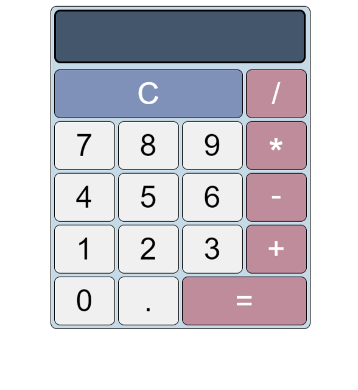

# Simple Calculator

This is a lightweight calculator application built with HTML, CSS, and JavaScript to perform basic mathematical operations. The calculator supports addition, subtraction, multiplication, and division, providing a user-friendly interface for quick calculations.

## Features

- **Addition:** Perform addition operations with ease.
- **Subtraction:** Subtract numbers effortlessly.
- **Multiplication:** Multiply numbers efficiently.
- **Division:** Divide numbers accurately.
- **Clear Function:** Reset the display to start a new calculation.

## Usage

1. **Numeric Buttons:** Click on the numeric buttons to input numbers.
2. **Operation Buttons:** Use the operation buttons (+, -, *, /) to perform corresponding operations.
3. **Equals (=) Button:** Press the equals button to view the result of the calculation.
4. **Clear Button (C):** Click the clear button to reset the display and start a new calculation.

## How to Run

Simply open the `index.html` file in a web browser to launch the calculator application.

Feel free to use and customize this calculator for your needs. If you have any suggestions or find any issues, please let me know.

Happy calculating!

Feel free to adjust the content based on your specific implementation and audience.
